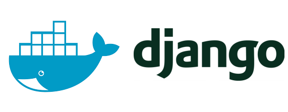

<p align="center">

</p>

# Django DRF Template

#### <b>Language</b>: Python 3.8

#### <b>Frameworks</b>:

- Django 3.0
- DRF 3.11

#### <b>Others</b>:

- Docker
- PostgreSQL

## How to Clone

With the script below its possible to clone this repo without getting the template's commits.

<i>OBS:</i> Change the project_name in the code with the name of your Django project.

```bash
git clone https://github.com/brenodega28/drf-docker-template.git project_name
cd project_name
rm -rf .git && git init
```

## Running Local

Make sure to create the local.env file _(using local.env.sample as a guide)_ before running.

```bash
cp local.env.sample local.env
make build # first time only
make migrate-local # Adds initial migration to DB
make superuser-local # Creates account for admin
make local # Starts server
```

## Makefile Commands

Some other commands stored on the Makefile.

```bash
make build # Creates Docker containers
make local # runs python manage.py runserver
make migrate-local # runs python manage.py migrate
make test # runs python manage.py test
make migrations # runs python manage.py makemigrations
make superuser-local # runs python manage.py createsuperuser
make local-windows # if make local does'nt work with your Windows, try this one instead
```
